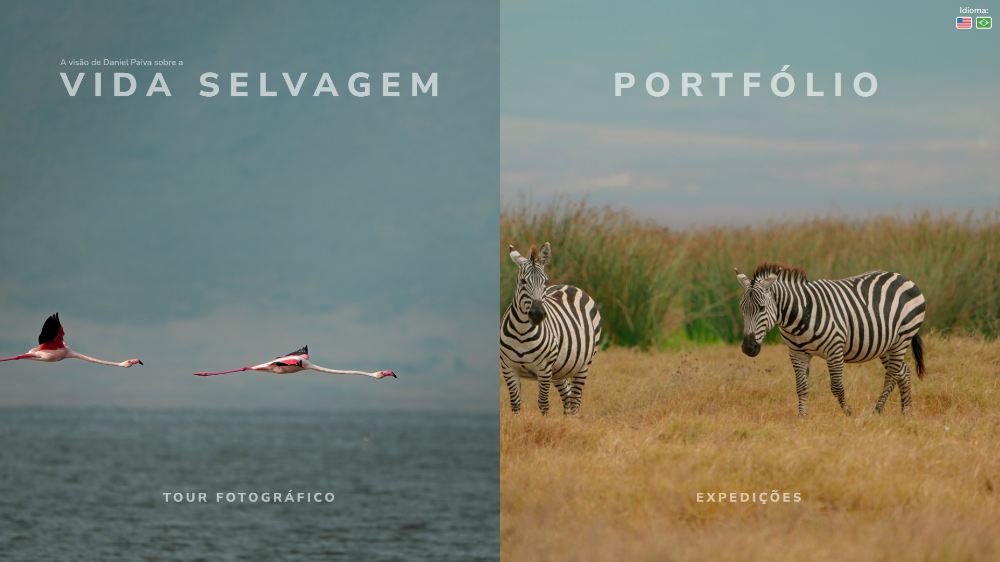

# 🌿 **A Visão de Daniel Paiva sobre a Vida Selvagem**



Um site profissional desenvolvido para o fotógrafo Daniel Paiva, especializado em registrar a beleza e a diversidade da vida selvagem ao redor do mundo. Este projeto destaca não apenas o talento do fotógrafo, mas também a vasta gama de biomas e ecossistemas que ele explora, com um design pensado para valorizar suas imagens e conectar pessoas com a natureza.

## 🔗 **Visão Geral**

Este site foi desenvolvido utilizando a última versão do Next.js com o novo App Router e funcionalidades avançadas como interceptação e rotas paralelas. A galeria de fotos foi integrada à API do Cloudinary para facilitar o gerenciamento de mídias, com navegação animada e suporte a compartilhamento de URLs dedicadas para cada imagem. Além disso, o projeto possui suporte à internacionalização utilizando `next-intl`, permitindo uma troca fluida entre os idiomas.

## 🛠️ **Principais Tecnologias**

- **Next.js**: Framework React para desenvolvimento rápido de aplicações web com renderização híbrida (SSG/SSR).
- **Cloudinary**: Plataforma para armazenamento e gerenciamento de imagens.
- **Next-Intl**: Biblioteca para internacionalização no Next.js.
- **Tailwind CSS**: Utilizado para estilização rápida e responsiva.
- **TypeScript**: Tipagem estática para um desenvolvimento mais seguro e escalável.

## 📁 **Estrutura do Projeto**

```bash
📦 projeto
├── 📁 public               # Arquivos estáticos como imagens, ícones e fontes
├── 📁 src                  # Diretório principal do código-fonte
│   ├── 📁 app              # Páginas e rotas principais utilizando o App Router do Next.js
│   ├── 📁 components       # Componentes React reutilizáveis para toda a aplicação
│   ├── 📁 i18n             # Configuração do `next-intl` para suporte a múltiplos idiomas
│   ├── 📁 messages         # Arquivos JSON contendo traduções para cada idioma
│   ├── 📁 utils            # Funções utilitárias específicas, como para a galeria e modal
│   ├── 📄 config.ts        # Configurações e variáveis de ambiente centralizadas
│   └── 📄 middleware.ts    # Middleware Next.js para manipulação de requests e rotas
├── 📄 .env                 # Variáveis de ambiente locais
├── 📄 .env.example         # Exemplo de variáveis de ambiente para configuração inicial
├── 📄 next.config.js       # Configurações de build e rotas do Next.js
├── 📄 tsconfig.json        # Configuração do TypeScript para o projeto
└── 📄 README.md            # Documentação do projeto

```

## 🚀 Instalação e Configuração
Pré-requisitos
- Node.js v16.0 ou superior
- Yarn ou NPM como gerenciador de pacotes
### Passo a Passo
1. Clone este repositório:

```
git clone https://github.com/seu-usuario/nome-do-projeto.git
cd nome-do-projeto

```
2. Instale as dependências

```
yarn install
# ou
npm install
# ou
pnpm install
```

3. Crie um arquivo `.env` na raiz do projeto com as variáveis de ambiente necessárias, conforme especificado no `env.example`:

```
NEXT_PUBLIC_CLOUDINARY_CLOUD_NAME=your_cloud_name
CLOUDINARY_API_KEY=your_api_key
CLOUDINARY_API_SECRET=your_api_secret
CLOUDINARY_FOLDER=your_folder_name
API_ENVIROMENT_VARIABLE=CLOUDINARY_URL=your_cloudinary_url
PORT=3000
VERCEL_URL=your_vercel_url

```
4. Inicie o ambiente de desenvolvimento:
```
npm run dev
# ou
pnpm run dev
```
5. Acesse o projeto no navegador em `http://localhost:3000`.

## 🌐 Internacionalização (i18n)
O projeto usa `next-intl` para gerenciar a internacionalização. A estrutura de rotas foi configurada para permitir URLs baseadas em idioma como `/en` e `/pt-BR`, e o conteúdo é renderizado de acordo com o idioma selecionado. A troca de idiomas acontece sem recarregar a página, proporcionando uma experiência mais fluida para o usuário.

Adicionando um novo idioma
Crie um arquivo de tradução no diretório `translations`.
Atualize os parâmetros de rotas no Next.js para incluir o novo idioma.
Adicione o novo idioma ao seletor de idioma no `LocaleSwitcher`.

## 🔄 Intercepting Routes e Parallel Routes
Este projeto faz uso extensivo dos novos conceitos de Intercepting Routes e Parallel Routes do Next.js:

- **Intercepting Routes**: Permite que rotas secundárias, como modais, sejam renderizadas sem sair da rota principal, preservando o estado e o contexto da página original.

- **Parallel Routes**: Permite renderizar componentes independentes dentro de uma mesma página, facilitando a implementação de layouts mais complexos, como dashboards e galerias.

## 🎨 Design e UI/UX
O design foi elaborado com base nas preferências do cliente, priorizando um estilo sério e moderno para destacar o conteúdo visual. Foram utilizadas referências do Figma e do Dribbble para construir a identidade visual e, após diversas rodadas de feedbacks, chegamos a um resultado que equilibra funcionalidade e estética. Todos os componentes foram desenvolvidos com Tailwind CSS, o que garantiu um desenvolvimento ágil e responsivo.


## 🤝 Contribuições
Contribuições são bem-vindas! Se você deseja adicionar novas funcionalidades ou encontrou algum problema, sinta-se à vontade para abrir um issue ou enviar um pull request.

## 💬 Contato
Se tiver alguma dúvida ou quiser saber mais detalhes sobre este projeto, entre em contato:

📧 Email: contact@tailvinicss.dev 

💼 LinkedIn: [Vinicius Gouvea](https://www.linkedin.com/in/vinicius-gouvea-969008289/)


# English Version

# 🌿 **Daniel Paiva's Vision of Wildlife**


A professional website developed for Daniel Paiva, a photographer specializing in capturing the beauty and diversity of wildlife around the world. This project showcases not only the photographer’s talent but also the vast range of biomes and ecosystems he explores, with a design aimed at highlighting his images and connecting people with nature.

## 🔗 **Overview**

This site was built using the latest version of Next.js with the new App Router and advanced features like route interception and parallel routes. The photo gallery is integrated with the Cloudinary API to facilitate media management, with animated navigation and support for dedicated sharing URLs for each image. Additionally, the project supports internationalization using `next-intl`, enabling a smooth language switch between different locales.

## 🛠️ **Key Technologies**

- **Next.js**: A React framework for fast web application development with hybrid rendering (SSG/SSR).
- **Cloudinary**: Platform for image storage and management.
- **Next-Intl**: Library for internationalization in Next.js.
- **Tailwind CSS**: Used for quick and responsive styling.
- **TypeScript**: Static typing for safer and more scalable development.

## 📁 **Project Structure**

```bash
📦 project
├── 📁 public               # Static files such as images, icons, and fonts
├── 📁 src                  # Main source code directory
│   ├── 📁 app              # Pages and main routes using the Next.js App Router
│   ├── 📁 components       # Reusable React components for the entire application
│   ├── 📁 i18n             # `next-intl` configuration for multi-language support
│   ├── 📁 messages         # JSON files containing translations for each language
│   ├── 📁 utils            # Utility functions, such as those for the gallery and modal
│   ├── 📄 config.ts        # Centralized configurations and environment variables
│   └── 📄 middleware.ts    # Next.js middleware for request and route handling
├── 📄 .env                 # Local environment variables
├── 📄 .env.example         # Example environment variables for initial setup
├── 📄 next.config.js       # Next.js build and route configurations
├── 📄 tsconfig.json        # TypeScript configuration for the project
└── 📄 README.md            # Project documentation

```

## 🚀 Install and Setup
Prerequisites
Node.js v16.0 or higher
Yarn or NPM as a package manager
### Step-by-Step
1. Clone this repository:

```
git clone https://github.com/seu-usuario/nome-do-projeto.git
cd nome-do-projeto

```
2. Install dependencies

```
yarn install
# or
npm install
# or
pnpm install
```

3. create a  `.env` file in the project root with the required environment varaibles as specified in `env.example`:

```
NEXT_PUBLIC_CLOUDINARY_CLOUD_NAME=your_cloud_name
CLOUDINARY_API_KEY=your_api_key
CLOUDINARY_API_SECRET=your_api_secret
CLOUDINARY_FOLDER=your_folder_name
API_ENVIROMENT_VARIABLE=CLOUDINARY_URL=your_cloudinary_url
PORT=3000
VERCEL_URL=your_vercel_url

```
4. Start the development server:
```
npm run dev
# or
pnpm run dev
```
5. Acesse o projeto no navegador em `http://localhost:3000`.

## 🌐 Internationalization (i18n)
The project uses `next-intl` to manage internationalization. The route structure is set up to allow for language-based URLs such as `/en` and `/pt-BR`, and the content is rendered based on the selected language. The language switch occurs without reloading the page, providing a smoother user experience.

Adding a New Language
- Create a translation file in the `translations` directory.
- Update the route parameters in Next.js to include the new language.
- Add the new language to the language selector in the `LocaleSwitcher` component.

## 🔄 Intercepting Routes e Parallel Routes
This project extensively utilizes the new concepts of Intercepting Routes and Parallel Routes in Next.js:

- **Intercepting Routes**: Allows secondary routes, such as modals, to be rendered without leaving the main route, preserving the state and context of the original page.

- **Parallel Routes**: Enables independent components to be rendered within the same page, facilitating the implementation of more complex layouts such as dashboards and galleries.


## 🎨 Design and UI/UX
The design was developed based on the client’s preferences, prioritizing a serious and modern style to highlight the visual content. Figma and Dribbble were used as references to build the visual identity, and after several rounds of feedback, we reached a result that balances functionality and aesthetics. All components were developed with Tailwind CSS, ensuring agile and responsive development.

## 🤝 Contributions
Contributions are welcome! If you want to add new features or find any issues, feel free to open an issue or submit a pull request.

## 💬 Contact
If you have any questions or want more details about this project, feel free to reach out:

📧 Email: contact@tailvinicss.dev 

💼 LinkedIn: [Vinicius Gouvea](https://www.linkedin.com/in/vinicius-gouvea-969008289/)
